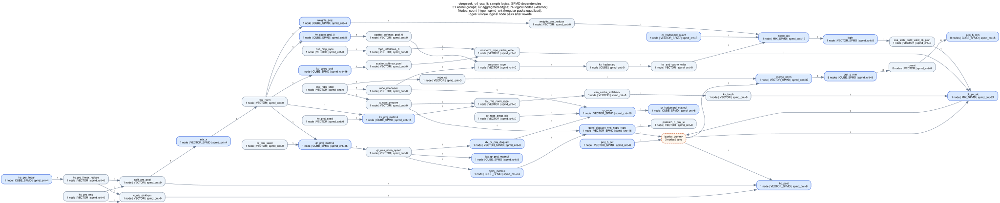
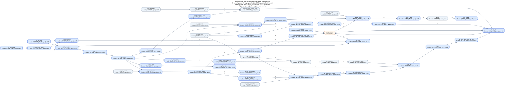

# DeepSeek V4 flash CSA（LT / HT）

## 用途

Painter 静态 DAG：来自 DeepSeek V4 flash CSA decode 上板捕获，覆盖小图（LT）与 5 刀 tiling 大图（HT）。

## 来源

| Case | V200 叶 | deps 逻辑任务 | 泳道物理 | header 逻辑节点 |
|------|---------|---------:|---------:|-------:|
| [`deepseek_v4_csa_lt.h`](../../cases/deepseek_v4_csa_lt.h) | `basic_batch4_mtp1` | 72 | 535 | 74 |
| [`deepseek_v4_csa_ht.h`](../../cases/deepseek_v4_csa_ht.h) | `ht_batch20_mtp3`（B=20、tile=4） | 239 | 3459 | 246 |

生成：`deps.json` + swimlane → `gen_capture_cases`（逻辑 SPMD 节点 + `total_spmd_cnt`；对角/分桶/`barrier_dummy`，见 [README](README.md)）。无异形混排，不改写 pack。

## 规模

| | LT | HT |
|--|--:|--:|
| `total_task_cnt` | 74 | 246 |
| barrier_dummy | 3 | 7 |
| 逻辑边 | 83 | 296 |
| `PAINTER_THREAD_CNT` | 1 | 1 |

## 结构图

主图为 **样例逻辑 SPMD**（节点标注 `type` / `spmd_cnt`）。捕获对照见 `figures/*_capture_deps.svg`。

### LT（basic B=4）



读图：hc_pre → indexer / proj → attention 路径较浅；当前口径下无同名/跨刀伪依赖可删。

### HT（ht batch20 · 5 刀）



读图：多组 `proj_a_mm` / `quant` / `proj_b_mm`；清洗后 `proj_b_act` / `hc_post` 只挂本刀前驱，同名兄弟不再 tensormap 串行。

重画结构图：

```bash
python3 tools/gen_capture_deps_svg.py --all
```

## 如何选用

```bash
./build_all.sh deepseek_v4_csa_lt
./build_all.sh deepseek_v4_csa_ht
```

## 注意

- duration：**ns**；`barrier_dummy` 为 0。
- MIX 不建模核内同步。
- 同宽链（如 act→post）对角展开；`qk_pv↔merge_norm` 等全员同步走 barrier dummy。
