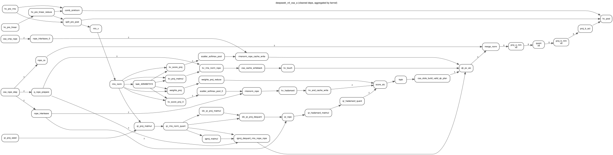
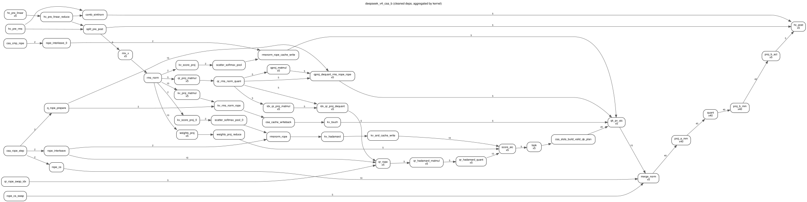

# DeepSeek V4 flash CSA（A / B）

## 用途

Painter 静态 DAG：来自 DeepSeek V4 flash CSA decode 上板捕获，覆盖小图（A）与 5 刀 tiling 大图（B）。

## 来源

| Case | V200 叶 | 逻辑任务 | 物理节点 |
|------|---------|---------:|---------:|
| [`deepseek_v4_csa_a.h`](../../cases/deepseek_v4_csa_a.h) | `V200-benchmark/deepseek_v4_flash_csa/basic_batch4_mtp1` | 72 | 535 |
| [`deepseek_v4_csa_b.h`](../../cases/deepseek_v4_csa_b.h) | `…/ht_batch20_mtp3`（B=20、tile=4） | 239 | 3459 |

生成口径同 Qwen：清洗后 `deps.json` + swimlane → `gen_capture_cases`。

## 规模

| | A | B |
|--|--:|--:|
| `total_task_cnt` | 535 | 3459 |
| Cube / Vector | 313 / 222 | 1833 / 1626 |
| `PAINTER_THREAD_CNT` | 1 | 1 |
| 清洗后逻辑边（相对 raw） | 204 → 204（无删边） | 736 → 652 |

## 结构图

### A（basic B=4）



读图：hc_pre → indexer / proj → attention 路径较浅；当前口径下无同名/跨刀伪依赖可删。

### B（ht batch20 · 5 刀）



读图：多组 `proj_a_mm` / `quant` / `proj_b_mm`；清洗后 `proj_b_act` / `hc_post` 只挂本刀前驱，同名兄弟不再 tensormap 串行。

## 如何选用

```bash
./build_all.sh deepseek_v4_csa_a
./build_all.sh deepseek_v4_csa_b
```

## 注意

- duration：**ns**。
- MIX 不建模核内同步。
- B 相对旧 header（3451 节点）以当前叶捕获为准为 **3459**；前驱边已去掉跨刀假依赖后显著变稀。
