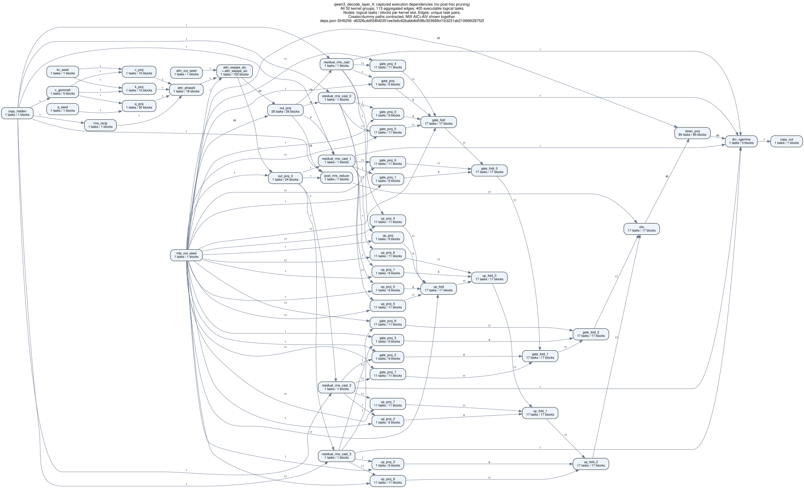
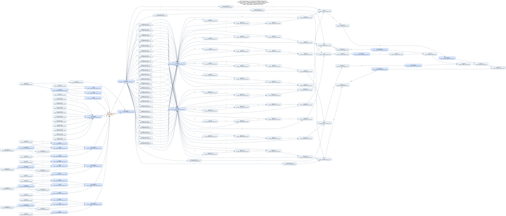

# Qwen3 decode layer（LT / HT）

Painter 静态 DAG，来自 Qwen3 单层 decode 的上板捕获，用于软件调度 / 解依赖压力测试。

## 来源与规模

Header 为 **逻辑 SPMD 节点**（`total_type` 0–5 + `total_spmd_cnt`）。异形 `out_proj` / `gate_proj` / `up_proj` 在样例侧按窗收成 5 路等宽包（out 50→5×10；gate/up 85→5×17，按 K），再经对角/分桶/`barrier_dummy` 挂边。

| | LT | HT |
|--|---:|---:|
| V200 源目录 | `qwen3_decode_layer/lt_batch16` | `qwen3_decode_layer/ht_batch80` |
| public batch / 16-row 窗口数 | 16 / 1 | 80 / 5 |
| 逻辑任务（含 dummy，deps） | 416 | 2080 |
| 泳道物理节点（校验用） | 943 | 3275 |
| header `total_task_cnt`（逻辑节点 + barrier） | 278 | 1378 |
| barrier_dummy | 5 | 13 |
| 逻辑边 | 545 | 2727 |
| 异形包 | out×5 / gate×5 / up×5（cnt 10/17/17） | 每窗同上 → 各 ×5 = 25 |
| PAINTER_THREAD_CNT | 1 | 1 |

非 SPMD：`spmd_cnt=0`。正规 SPMD（如 `q_proj` bn=50）保留单节点并写真实宽度。

输入为叶目录的 `deps.json`、`chip_swimlane_records.json` 和 `name_map.json`，完整同步到 `Scheduler/workloads/`。生成器见 [README · SPMD](README.md)。

## 结构图

主图为 **样例逻辑 SPMD**（与 header 同源：`type` / `spmd_cnt`，异形已 5 路均分）。SPMD 节点深蓝底；`barrier_dummy` 虚线框。

### LT



### HT



捕获对照（改写前 V200 deps，`N tasks / M blocks`）：

- [lt_capture_deps.svg](figures/qwen3_decode_layer_lt_capture_deps.svg)
- [ht_capture_deps.svg](figures/qwen3_decode_layer_ht_capture_deps.svg)

## 复核与生成

在 Scheduler 目录执行：

```bash
python3 tools/audit_qwen_deps.py workloads/qwen3_decode_layer_lt
python3 tools/audit_qwen_deps.py workloads/qwen3_decode_layer_ht
python3 tools/gen_capture_cases.py --check qwen3_decode_layer_lt qwen3_decode_layer_ht
python3 tools/gen_capture_deps_svg.py --all
python3 -m pytest tests/test_irregular_spmd.py tests/test_capture_deps_svg.py tests/test_capture_cases.py -q
```

duration 单位为 ns；C header 测试使用主机 DAG 遍历。
